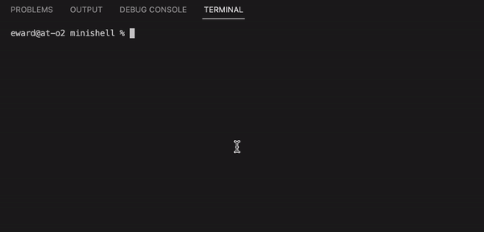

// name and explonation and status
// installation
// usage
# 🐚 Minishell
As beatiful as shell...
 
The project is about copying some features of bash console, such as echo, pwd, ls, redirects, pipes and etc. This is a team project for school42. 

# Installation
I didn't try to run code on Linux, so instruction only for MacOS:
 
1. Install brew (to use signals)
2. Clone repo
3. Cd to minishell
4. Run "make"
5. ✨ Profit! ✨
# Usage
Run "./minishell" and then you can enter bash comands.
 
# Working demo:
 

# Creators
Me @vvmorozova wrote parser and helped a bit to 
 
@mikovanastya to write executor
